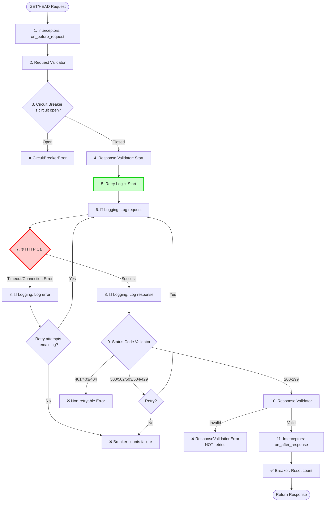
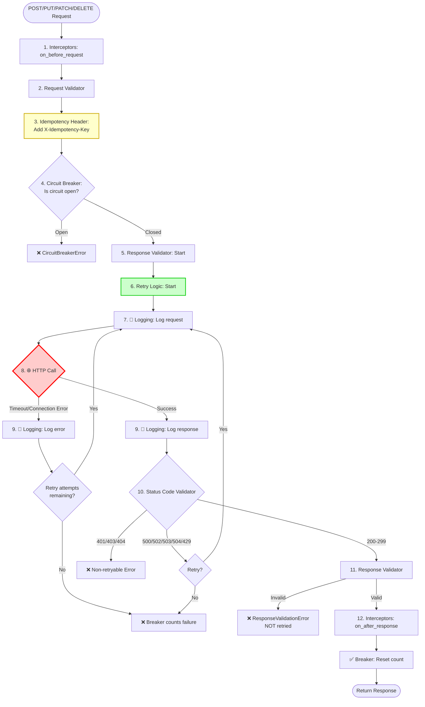

# reqflow: A Resilient HTTP Client

A production-grade, extensible, and resilient HTTP client for Python, designed for reliable communication with external REST APIs.

This module provides a `RestClient` that abstracts away the complexities of API communication, allowing developers to focus on business logic instead of boilerplate code for retries, logging, validation, and error handling. It is built on Python's `requests` library and heavily inspired by middleware patterns.

## Table of Contents

- [Core Features](#core-features)
- [Installation & Dependencies](#installation--dependencies)
- [Development Setup](#development-setup)
- [Quick Start: Fetching a User](#quick-start-fetching-a-user)
- [Async Quick Start](#async-quick-start)
- [How It Works: The Behavior Pipeline](#how-it-works-the-behavior-pipeline)
- [Advanced Usage](#advanced-usage)
- [Async Usage](#async-usage)
- [Testing](#testing)
- [Building](#building)
- [Detailed Error Handling](#detailed-error-handling)

---

## Core Features

-   **Fluent Interface**: Simple, clean methods for `get`, `post`, `put`, `patch`, and `delete`.
-   **Type-Safe**: Uses Pydantic models for compile-time validation of request and response objects.
-   **Behavior-Based Pipeline**: A Chain of Responsibility pattern processes requests through modular "behaviors."
-   **Automatic Retries**: Configurable exponential backoff for transient network errors and specific HTTP status codes.
-   **Circuit Breaker**: Protects your application from failing services using a Redis-backed circuit breaker (`pybreaker`).
-   **Idempotency Headers**: Automatically adds idempotency keys to POST/PUT/DELETE requests for safe retries.
-   **Rich Error Handling**: A detailed custom exception hierarchy for precise error handling.
-   **Structured Logging**: Logs sanitized request/response data for debugging and monitoring.

---

## Installation & Dependencies

### Runtime Dependencies

-   `requests>=2.31.0`
-   `pydantic>=2.0.0`
-   `pybreaker>=1.0.0`

### Optional Dependencies

-   `redis>=4.5.0` (for Redis-backed circuit breaker)
-   `httpx>=0.24.0` and `redis[asyncio]>=4.5.0` (for async support)

### Installation

```bash
# Basic installation
pip install reqflow

# With async support
pip install reqflow[async]

# With all optional dependencies
pip install reqflow[all]
```

Or using `uv`:

```bash
uv add reqflow
uv add reqflow[async]  # For async support
```

---

## Development Setup

This project uses modern Python tooling for development:

- **uv** - Fast Python package manager
- **ruff** - Fast Python linter and formatter
- **just** - Command runner (like Make)
- **pytest** - Testing framework

### Prerequisites

1. Install **uv**: https://github.com/astral-sh/uv
   ```bash
   curl -LsSf https://astral.sh/uv/install.sh | sh
   ```

2. Install **just**: https://github.com/casey/just
   ```bash
   # macOS
   brew install just
   
   # Linux
   cargo install just
   ```

### Quick Start

```bash
# Install dependencies
just install-dev

# Run tests
just test

# Format code
just format

# Lint code
just lint

# Run all checks
just check
```

### Available Commands

Run `just` or `just help` to see all available commands:

#### Development
- `just install` - Install dependencies
- `just install-dev` - Install with dev dependencies
- `just test` - Run tests
- `just test-cov` - Run tests with coverage
- `just format` - Format code with ruff
- `just lint` - Lint code with ruff
- `just fix` - Format and fix linting issues
- `just check` - Check formatting and linting

#### Building
- `just build` - Build package
- `just clean` - Clean build artifacts

#### Other
- `just info` - Show project info
- `just deps` - Show dependency tree
- `just update` - Update dependencies

### Workflow

1. **Before committing:**
   ```bash
   just fix    # Format and fix linting
   just test   # Run tests
   ```

2. **CI checks:**
   ```bash
   just ci     # Run all checks (format, lint, test)
   ```

### Project Structure

```
reqflow/
├── pyproject.toml      # Project configuration (PEP 621)
├── uv.lock            # Locked dependencies (uv)
├── Justfile           # Task runner commands
├── reqflow/           # Source code
│   ├── __init__.py
│   ├── rest_client.py
│   ├── behaviors.py
│   └── ...
└── tests/             # Test suite
    ├── conftest.py
    ├── test_*.py
    └── ...
```

### Code Style

This project uses **ruff** for formatting and linting. Configuration is in `pyproject.toml`.

- Line length: 100 characters
- Quote style: Double quotes
- Target Python: 3.9+

---

## Quick Start: Fetching a User

This example walks through the entire process of setting up the client and making your first API call.

### Step 1: Define Your Data Models

First, define the Pydantic models for your API's request and response payloads. This ensures all data is validated.

```python
# in your_app/schemas.py
from pydantic import BaseModel, Field

class User(BaseModel):
    id: int
    name: str
    email: str

class ErrorResponse(BaseModel):
    detail: str
```

### Step 2: Initialize the RestClient

Create a shared instance of the client for the external service you want to communicate with. For production use, it is critical to configure a **Circuit Breaker**.

```python
# in your_app/clients.py
from reqflow import RestClient
from reqflow.circuit_breakers import create_shared_breaker

# For production, create a shared circuit breaker for each external service.
# This prevents cascading failures if the service goes down.
user_api_breaker = create_shared_breaker(
    service_name="user_api",
    fail_max=5,         # Opens the circuit after 5 consecutive failures
    reset_timeout=60    # Tries to close the circuit after 60 seconds
)

# Create the client instance, injecting the breaker
user_service_client = RestClient(
    base_url="https://api.example.com/v1",
    service_name="user_api",
    breaker=user_api_breaker, # Inject the circuit breaker
    max_retries=3
)
```

### Step 3: Make the API Call

Now, use your client instance to make a type-safe HTTP request. If the circuit breaker is open, this call will fail instantly without sending a network request.

```python
# in your_app/services.py
from .clients import user_service_client
from .schemas import User
from reqflow.errors import ResourceNotFoundError, RestClientError, CircuitBreakerOpenError

def get_user_by_id(user_id: int) -> User | None:
    """Fetches a user and handles potential API errors."""
    try:
        print(f"Fetching user {user_id}...")
        user = user_service_client.get(
            endpoint=f"/users/{user_id}",
            response_data_schema=User
        )
        print(f"Found user: {user.name} ({user.email})")
        return user
    except CircuitBreakerOpenError:
        # The circuit is open, so we didn't even try to send the request.
        # Log this and maybe notify a monitoring service.
        print("Circuit is open for user_api. Request was not sent.")
        return None
    except ResourceNotFoundError:
        print(f"User with ID {user_id} not found.")
        return None
    except RestClientError as e:
        print(f"An unexpected API error occurred: {e}")
        return None

# Example usage:
get_user_by_id(123)
```

---

## Async Quick Start

reqflow also provides full async support using `httpx` and native async/await patterns.

### Installation

```bash
pip install reqflow[async]
```

### Basic Async Usage

```python
import asyncio
from reqflow import AsyncRestClient
from reqflow.async_circuit_breakers import create_shared_async_breaker

# Define your models (same as sync)
from pydantic import BaseModel

class User(BaseModel):
    id: int
    name: str
    email: str

async def main():
    # Create async circuit breaker
    breaker = await create_shared_async_breaker(
        service_name="user_api",
        fail_max=5,
        reset_timeout=60
    )
    
    # Create async client
    async with AsyncRestClient(
        base_url="https://api.example.com/v1",
        service_name="user_api",
        breaker=breaker,
    ) as client:
        # Make async requests
        user = await client.get("/users/1", response_data_schema=User)
        print(f"User: {user.name} ({user.email})")

# Run the async function
asyncio.run(main())
```

### Key Differences from Sync Client

- Use `AsyncRestClient` instead of `RestClient`
- All methods are `async def` and must be awaited
- Use `async with` for proper resource cleanup
- Use `create_shared_async_breaker()` for circuit breakers
- Use `AsyncInterceptor` for interceptors
- Idempotency headers are automatically added to POST/PUT/PATCH requests

---

## How It Works: Dual Pipeline Architecture

ReqFlow uses two optimized behavior pipelines to maximize performance and clarity:

- **Read Pipeline** (GET, HEAD): Optimized for read operations
- **Write Pipeline** (POST, PUT, PATCH, DELETE): Optimized for write operations with idempotency headers

Each pipeline consists of `Behavior` objects that process requests in a specific order. This separation ensures that read operations don't pay the cost of idempotency checks.

### Read Pipeline (GET, HEAD)



### Write Pipeline (POST, PUT, PATCH, DELETE)



### Key Differences

| Feature | Read Pipeline | Write Pipeline |
|---------|--------------|----------------|
| **Methods** | GET, HEAD | POST, PUT, PATCH, DELETE |
| **Idempotency Headers** | ❌ Not needed | ✅ Auto-adds X-Idempotency-Key |
| **Performance** | Optimized for repeated reads | Optimized for safe mutations |

---

## Advanced Usage

### Recommended Usage: The Typed Client Pattern

For cleaner, more maintainable, and testable code, we strongly recommend wrapping the generic `RestClient` in a **domain-specific client**. This pattern encapsulates all API-specific logic, such as endpoints and data models, into a dedicated class.

**Why use this pattern?**
-   **Encapsulation:** Your application's services don't need to know about API endpoints or response models. They just call methods like `user_service_client.get_users()`.
-   **Readability:** `user_service_client.get_user_by_id(user_id=123)` is much clearer and less error-prone than using the generic `get()` method with multiple parameters.
-   **Testability:** You can easily mock `UserServiceClient` in your unit tests.

### Protecting Your System with a Circuit Breaker

The **Circuit Breaker** is a critical pattern for building resilient applications that interact with external services. Its purpose is to prevent your application from repeatedly trying to call a service that is known to be failing.

-   **Why use it?** If an external service is down, sending it more requests wastes resources (network sockets, CPU time) and can lead to cascading failures throughout your system. The circuit breaker acts as a temporary guard.
-   **How it works:**
    1.  **Closed:** The breaker starts in the "closed" state, allowing all requests to pass through. It counts failures.
    2.  **Open:** If the number of failures exceeds a threshold (`fail_max`), the breaker "opens." In this state, it immediately rejects all further requests with a `CircuitBreakerOpenError` *without* sending them over the network.
    3.  **Half-Open:** After a configured timeout (`reset_timeout`), the breaker enters the "half-open" state. It allows a single "trial" request to pass through. If it succeeds, the breaker closes. If it fails, the breaker opens again.

```python
# For production apps, always create a shared breaker for each service client.
# The `create_shared_breaker` helper uses Redis to share the state of the
# breaker across all your application processes and servers.

from reqflow.circuit_breakers import create_shared_breaker

payments_breaker = create_shared_breaker(
    service_name="payments_api",
    fail_max=3,
    reset_timeout=120 # Give the payment service 2 minutes to recover
)

payments_client = RestClient(
    base_url="https://api.payments.com/v1",
    service_name="payments_api",
    breaker=payments_breaker, # Inject the breaker
    # ... other config
)
```

### Idempotency Headers

The client automatically adds `X-Idempotency-Key` headers to POST/PUT/DELETE requests to ensure safe retries. This prevents duplicate operations if a request is retried due to network issues.

```python
# Idempotency headers are added automatically for mutation requests
response = client.post(
    endpoint="/orders",
    request_data=order_data,
    response_data_schema=OrderResponse
)
# The request will include an auto-generated X-Idempotency-Key header
```

### Per-Request Overrides

You can override default settings on a per-call basis.

```python
# This critical call will retry up to 5 times instead of the default 3
user_service_client.post(
    endpoint="/users/critical-update",
    request_data=update_data,
    response_data_schema=User,
    max_retries=5 # Override
)
```

### Using Interceptors

Interceptors are powerful hooks for adding custom logic. For example, injecting a `X-Correlation-ID` for distributed tracing.

**1. Create the Interceptor:**
```python
# in your_app/interceptors.py
from reqflow.interceptors import Interceptor
from reqflow.request_response import RequestContext, ResponseContext
from reqflow.errors import RestClientError

class LoggingInterceptor(Interceptor):
    def on_before_request(self, request: RequestContext):
        print(f"Making request to {request.url}")
    
    def on_after_response(self, response: ResponseContext):
        print(f"Received response with status {response.status_code}")
    
    def on_error(self, error: RestClientError):
        print(f"Request failed: {error}")
```

**2. Add it to the Client:**
```python
# in your_app/clients.py
from .interceptors import LoggingInterceptor

logging_interceptor = LoggingInterceptor()

client = RestClient(
    base_url="...",
    service_name="some_service",
    interceptors=[logging_interceptor] # Add interceptors here
)
```

### Creating a Domain-Specific Client (Example: User Service)

Here's a step-by-step example of how to build and use a typed client for a User Service API.

**1. Define API-Specific Models**

```python
# in your_app/user_service/schemas.py
from pydantic import BaseModel
from typing import List, Optional

class User(BaseModel):
    id: int
    name: str
    email: str
    role: str

class CreateUserRequest(BaseModel):
    name: str
    email: str
    role: Optional[str] = "member"

class UsersResponse(BaseModel):
    users: List[User]
    total: int
```

**2. Create the Typed Client Class**

This class will contain the `RestClient` and expose methods for specific API operations.

```python
# in your_app/user_service/client.py
from reqflow import RestClient
from .schemas import UsersResponse, User, CreateUserRequest

class UserServiceClient:
    def __init__(self, rest_client: RestClient):
        self._client = rest_client

    def get_users(self, page: int = 1, limit: int = 10) -> List[User]:
        """Fetches a paginated list of users."""
        # The typed client knows the specific endpoint, params, and response model.
        response = self._client.get(
            endpoint="/users",
            params={"page": page, "limit": limit},
            response_data_schema=UsersResponse
        )
        return response.users

    def get_user_by_id(self, user_id: int) -> User:
        """Fetches a single user by their ID."""
        return self._client.get(
            endpoint=f"/users/{user_id}",
            response_data_schema=User
        )

    def create_user(self, user_data: CreateUserRequest) -> User:
        """Creates a new user."""
        return self._client.post(
            endpoint="/users",
            request_data=user_data,
            response_data_schema=User
        )
```

**3. Configure and Use the Client**

In your application's setup, create the generic `RestClient` and inject it into your new `UserServiceClient`.

```python
# in your_app/main.py or services.py

from reqflow import RestClient
from .user_service.client import UserServiceClient
from reqflow.errors import RestClientError

# 1. Create the generic RestClient for User Service (with breaker, etc.)
user_service_rest_client = RestClient(
    base_url="https://api.example.com/v1",
    service_name="user_service",
    # ... other config
)

# 2. Create the typed client instance by injecting the generic client
user_service_client = UserServiceClient(rest_client=user_service_rest_client)


# 3. Use the clean, typed client in your business logic
def list_all_users():
    try:
        users = user_service_client.get_users(page=1, limit=50)
        print(f"Found {len(users)} users.")
        for user in users:
            print(f"- {user.name} ({user.email}) - Role: {user.role}")
    except RestClientError as e:
        print(f"Error communicating with User Service: {e}")

list_all_users()
```

---

## Testing

Tests are located in the `tests/` directory and use pytest. The test suite is designed to be "battle-tested" and covers all major functionality, edge cases, and error scenarios.

### Test Structure

- `test_rest_client.py` - Tests for the main RestClient class (all HTTP methods, error handling, edge cases)
- `test_behaviors.py` - Tests for all behaviors in the pipeline (retry, validation, circuit breaker, etc.)
- `test_circuit_breaker.py` - Tests for circuit breaker functionality
- `test_interceptors.py` - Tests for interceptor functionality
- `test_errors.py` - Tests for error handling and error context
- `test_integration.py` - Integration tests for the full pipeline
- `conftest.py` - Shared fixtures and test configuration

### Running Tests

```bash
# Run all tests
just test

# Run specific test file
just test-file test_rest_client.py

# Run with coverage
just test-cov

# Run in parallel
just test-parallel
```

Or using pytest directly:

```bash
# Run all tests
pytest

# Run specific test files
pytest tests/test_rest_client.py
pytest tests/test_behaviors.py
pytest tests/test_integration.py

# Run with verbose output
pytest -v

# Run specific test classes or functions
pytest tests/test_rest_client.py::TestRestClientGet
pytest tests/test_rest_client.py::TestRestClientGet::test_successful_get

# Run with coverage
pytest --cov=reqflow --cov-report=html

# Run tests in parallel
pytest -n auto
```

### Test Coverage

The test suite covers:

1. **RestClient**
   - All HTTP methods (GET, POST, PUT, PATCH, DELETE)
   - Success and error scenarios
   - Retry logic
   - Per-request overrides
   - URL construction edge cases
   - Thread safety

2. **Behaviors**
   - LoggingBehavior
   - RequestValidationBehavior
   - ResponseValidationBehavior
   - RetryBehavior
   - IdempotencyHeaderBehavior
   - StatusCodeValidationBehavior
   - HttpBehavior
   - CircuitBreakerBehavior
   - InterceptorBehavior

3. **Circuit Breaker**
   - Circuit opening/closing
   - Fail-fast behavior
   - Redis fallback

4. **Interceptors**
   - Request/response interception
   - Error interception
   - Multiple interceptors

5. **Idempotency**
   - Automatic header generation
   - POST/PUT/PATCH only

6. **Error Handling**
   - All error types
   - Error context
   - Error inheritance hierarchy

7. **Integration**
   - Full pipeline tests
   - Real-world scenarios
   - Error recovery
   - Rate limiting

### Writing New Tests

When adding new features, follow these guidelines:

1. **Test Structure**: Follow the existing pattern with test classes grouping related tests
2. **Fixtures**: Use fixtures from `conftest.py` when possible
3. **Mocking**: Use `requests_mock` for HTTP mocking, `MagicMock` for other mocks
4. **Assertions**: Use descriptive assertions and check both success and error cases
5. **Edge Cases**: Always test edge cases (None values, empty strings, boundary conditions)

### Example Test

```python
def test_successful_get(self, basic_client, requests_mock):
    """Test successful GET request."""
    requests_mock.get(
        "https://api.example.com/v1/users/1",
        json={"id": 1, "name": "John", "email": "john@example.com"},
        status_code=200,
    )

    response = basic_client.get("/users/1", response_data_schema=User)
    assert response is not None
    assert response.id == 1
    assert response.name == "John"
```

### Continuous Integration

These tests are designed to run in CI/CD pipelines. They:
- Don't require external services (all HTTP calls are mocked)
- Are deterministic (no random behavior)
- Run quickly (most tests complete in <1 second)
- Are isolated (tests don't depend on each other)

---

## Building

```bash
# Build package
just build

# Build source distribution
just build-sdist

# Build wheel
just build-wheel
```

---

## Async Usage

### Async Circuit Breaker

The async circuit breaker works similarly to the sync version but uses async Redis operations:

```python
from reqflow.async_circuit_breakers import create_shared_async_breaker

# Create async circuit breaker (supports Redis for shared state)
breaker = await create_shared_async_breaker(
    service_name="payment_api",
    fail_max=3,
    reset_timeout=120
)

async_client = AsyncRestClient(
    base_url="https://api.payments.com/v1",
    service_name="payment_api",
    breaker=breaker,
)
```

### Async Interceptors

Create async interceptors for custom logic:

```python
from reqflow.async_interceptors import AsyncInterceptor
from reqflow.request_response import RequestContext, ResponseContext
from reqflow.errors import RestClientError

class LoggingInterceptor(AsyncInterceptor):
    async def on_before_request(self, request: RequestContext):
        print(f"Making request to {request.url}")
    
    async def on_after_response(self, response: ResponseContext):
        print(f"Received response with status {response.status_code}")
    
    async def on_error(self, error: RestClientError):
        print(f"Request failed: {error}")

# Use in async client
interceptor = LoggingInterceptor()
async_client = AsyncRestClient(
    base_url="https://api.example.com/v1",
    service_name="some_service",
    interceptors=[interceptor]
)
```

### Context Manager Usage

Always use `async with` for proper cleanup:

```python
async with AsyncRestClient(
    base_url="https://api.example.com/v1",
    service_name="my_service"
) as client:
    user = await client.get("/users/1", response_data_schema=User)
    # Client is automatically closed when exiting the context
```

---

## Detailed Error Handling

The client raises specific exceptions, allowing for fine-grained error handling.

```python
from reqflow.errors import RateLimitError, ServerError, RestClientError, CircuitBreakerOpenError

try:
    # ... make a request ...
except CircuitBreakerOpenError as e:
    # The request was blocked by the circuit breaker.
    # This is a good place to log that the external service is down.
    print(f"Failing fast! The circuit breaker is open for this service: {e}")
except RateLimitError as e:
    # The client has already waited for the 'Retry-After' header.
    # You might want to log this or re-queue the task for later.
    print(f"Rate limited. The request will need to be tried again later. Details: {e}")
except ServerError as e:
    # The service is likely down; retries have already been attempted.
    print(f"The remote server is failing. Error: {e}")
except RestClientError as e:
    # Catch any other client error for generic handling.
    print(f"An unexpected API error occurred: {e}")
```

---

## License

MIT
